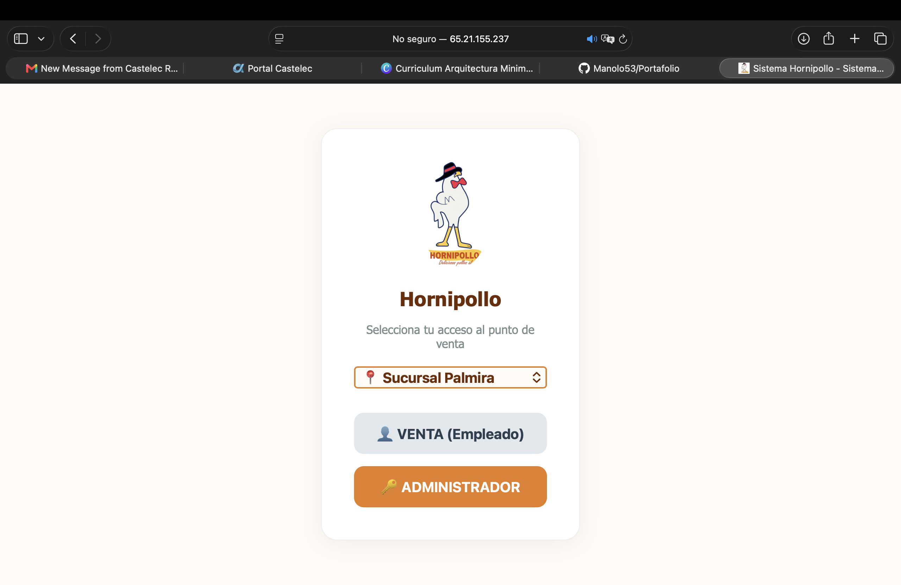

Sistema POS e inventario

Aplicación de punto de venta con una interfaz web y una API local en Node.js. Permite registrar ventas, consultar inventario, registrar gastos e imprimir tickets.

Proyecto de portafolio. Usa datos ficticios y no incluye credenciales ni conexión a un servidor remoto.

Funcionalidades

Registro de ventas y detalle de productos.

Consulta y actualización de existencias.

Registro de gastos por sucursal.

Impresión local de tickets.

Consulta del estado de PostgreSQL.

Sincronización remota opcional, desactivada por defecto.

Interfaz en español adaptable a pantallas pequeñas.

Tecnologías

Node.js y Express

PostgreSQL

JavaScript, HTML y CSS

Axios y dotenv

CUPS para impresión local opcional

